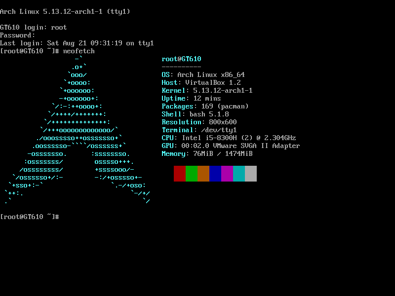

# 🌿 Hyprland Dotfiles

This repository contains my personal dotfiles for a beautiful and functional Hyprland-based Wayland setup. It includes configuration files for terminal emulators, window manager, status bars, launchers, and more — with smooth animations and a minimal aesthetic.

## 📷 Screenshots

### Before config



### After config


### Video

[](https://youtu.be/ss338nzKyZc)

## 📁 Directory Structure

- `alacritty/` — Configuration for the Alacritty terminal.
- `eww/.config/eww` — Eww widgets and bar setup.
- `hypr/.config/hypr` — Main Hyprland configuration (window manager).
- `kitty/.config/kitty` — Kitty terminal with smooth animations.
- `nvim/.config/nvim` — Neovim setup optimized for coding.
- `rofi/.config/rofi` — Rofi launcher configuration.
- `tmux/` — Tmux config with smooth transitions.
- `wallpaper/` — Wallpapers used in the setup.
- `waybar/.config/waybar` — Waybar status bar config for Wayland.
- `wezterm/.config/wezterm` — WezTerm terminal config.
- `wofi/.config/wofi` — Wofi launcher for Wayland.
- `README.md` — This file.

## ✨ Features

- ✅ Clean and minimal design.
- ✅ Smooth UI animations.
- ✅ Multiple terminal options (`alacritty`, `kitty`, `wezterm`).
- ✅ Rofi and Wofi launchers support.
- ✅ Beautiful status bars using `eww` and `waybar`.
- ✅ Developer-friendly Neovim config.
- ✅ Dotfile management using **GNU Stow**.

## 🛠 Requirements

- **Hyprland** (Wayland compositor)
- `eww`, `waybar`, `rofi`, `wofi`
- `kitty`, `alacritty`, `wezterm`
- `neovim`, `tmux`
- `stow`
- File Manager: **Nautilus**
- Web Browser: **Zen Browser** — chosen for its clean and beautiful interface
- Recommended fonts: `Hack Nerd Font`, `FiraCode`, etc.

## 🛠 System Info

- 🖥️ **File Manager**: Nautilus
- 🌐 **Default Browser**: Zen Browser (clean and beautiful interface)
- ⚙️ **Dotfile Manager**: GNU Stow

## 🚀 Installation

> Make sure you have `stow` installed:  
> `sudo pacman -S stow` (for Arch-based distros)

```bash
# Clone this repository
git clone https://github.com/your-username/dotfiles ~/.dotfiles
cd ~/.dotfiles

# Use stow to symlink config folders
stow alacritty
stow hypr
stow kitty
stow nvim
stow rofi
stow tmux
stow waybar
stow wezterm
stow wofi
stow eww
```
